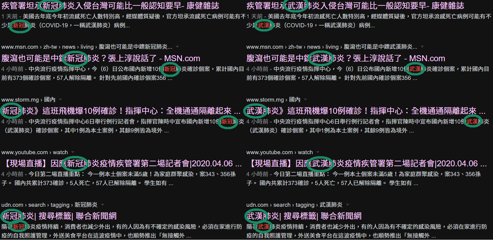

# OkWuHanPneumonia
## 「好的！！武漢肺炎」：厭倦舔共媒體與共匪同路人堅持使用新冠肺炎嗎？？不要再吵惹，直接一鍵全部變回武漢肺炎！！

近日不論板上或社會，都為究竟該如何稱呼某充滿中國特色的新型冠狀病毒所引發的肺炎持續爭論著。

目前，這個病毒的官方名稱是由 WHO *2/11* 所命之 `SARS-CoV-2(2019-nCoV)`，肺炎稱為 `COVID-19`。

我國中央流行疫情指揮中心在英文方面依照 WHO，中文則定為「嚴重特殊傳染性肺炎」，並以「武漢肺炎」簡稱。

到這裡其實完全沒有問題，然而就是有媒體唯恐天下不亂，硬是不遵從指揮中心的稱呼慣例，反而在共匪 *2/8* 自行單方面宣布「~~新冠肺炎~~」、「~~NCP~~」時就立刻完全乖乖配合名，實在別有用意、居心叵測。

那麼我們到底應當如何稱呼呢？？

對於那些舔共仔，就是一句話：「__好的！！武漢肺炎__」

據我不專業觀察，大部份鄉民們或還是以「__武漢肺炎__」為主，甚至用「~~新冠~~」就會被噓暴。雖然我很不喜歡「~~新冠~~」這個名字，但是我認為吵這個實在很無聊。其實，我們只要把看得到的所有「~~新冠~~」都取代為「__武漢__」，給它來個眼不見為淨，那豈不是皆大歡喜、天下太平嗎？？

所以我寫惹個非常簡單ㄉ Chrome 插件，幫大家把所有「~~新冠~~」都取代為「__武漢__」。

有裝 Tampermonkey 或 Greasemonkey 的人也可以裝 [userscript](https://github.com/nevikw39/OkWuHanPneumonia/raw/master/main.user.js)

## 手機使用方法

若您的移動作業系統為 *Android*，推薦使用 [Kiwi Browser](https://play.google.com/store/apps/details?id=com.kiwibrowser.browser)。

若您有使用 *AdGuard*，也可以安裝 __userscript__:
1. 啟動 *AdGuard*
2. 進入設定
3. 選擇擴充插件
4. 點擊新增、輸入 https://github.com/nevikw39/OkWuHanPneumonia/raw/master/main.user.js
5. 完成